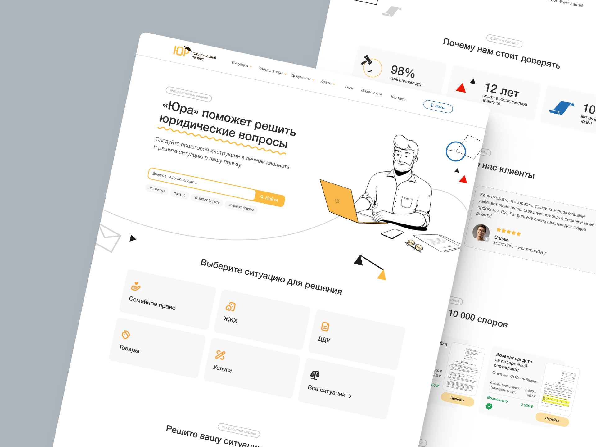
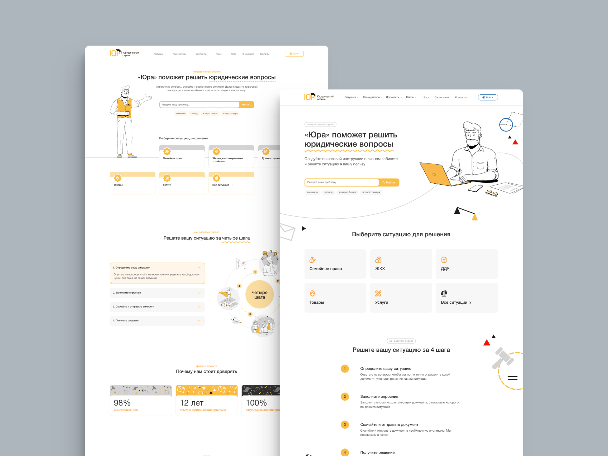
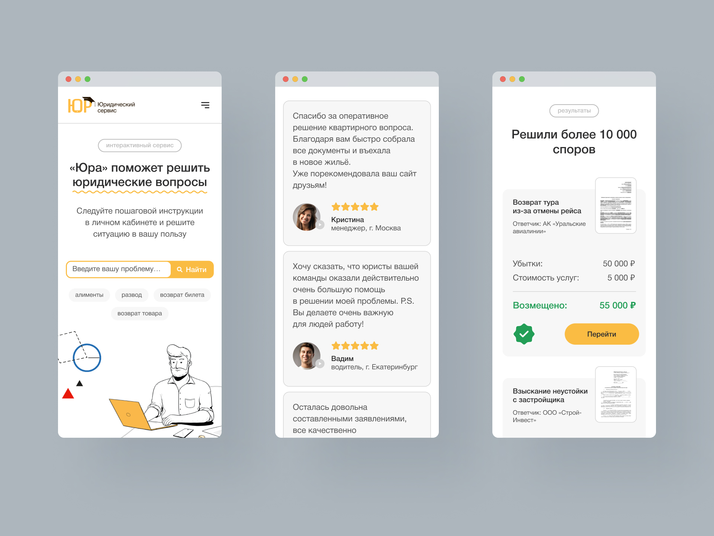
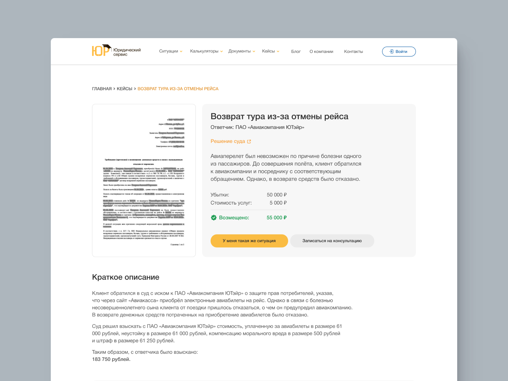
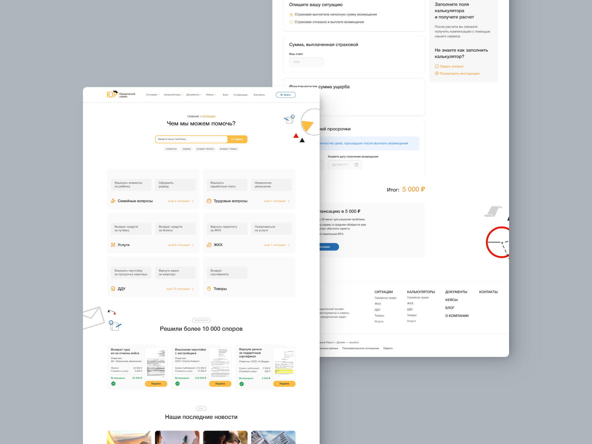
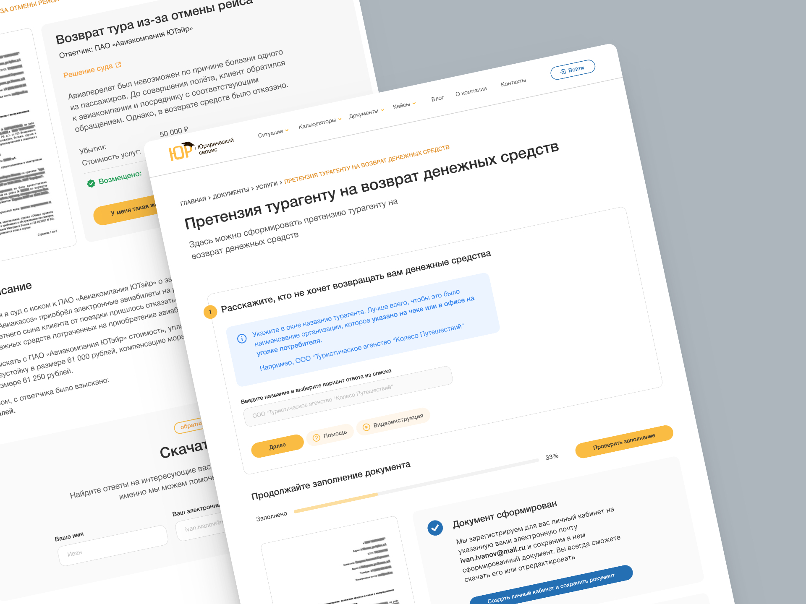

## Задача

Сделать **понятным и легко воспринимаемым** большое количество специальной информации: юридические детали выигранных компанией кейсов, инструкции по использованию сервиса и калькуляторов отчислений, примеры и правила подачи документов.

**Визуализировать механизм предварительного опроса** пользователя и последующего разъяснения юридической ситуации.

## Решение

Сопроводить **визуальными подсказками** (инфографикой, уже имевшимися иконками и иллюстрациями) как можно большее количество информации. Сделать интерфейс как самого сайта, так и в частности опросника максимально простым, интуитивно понятным для пользователя. Чего можно достичь путем следования как можно большему количеству **UX конвенций** (UX conventions).

При этом, сохранить идентичность, самобытность дизайна и придать узнаваемости бренду путем использования фирменной графики, **создания узнаваемых и повторяющихся элементов,** по типу подчеркивания значимых слов в заголовках и **использования основных цветов** (красный - ошибка, зеленый - успешно) для упрощения логических элементов опросника.

