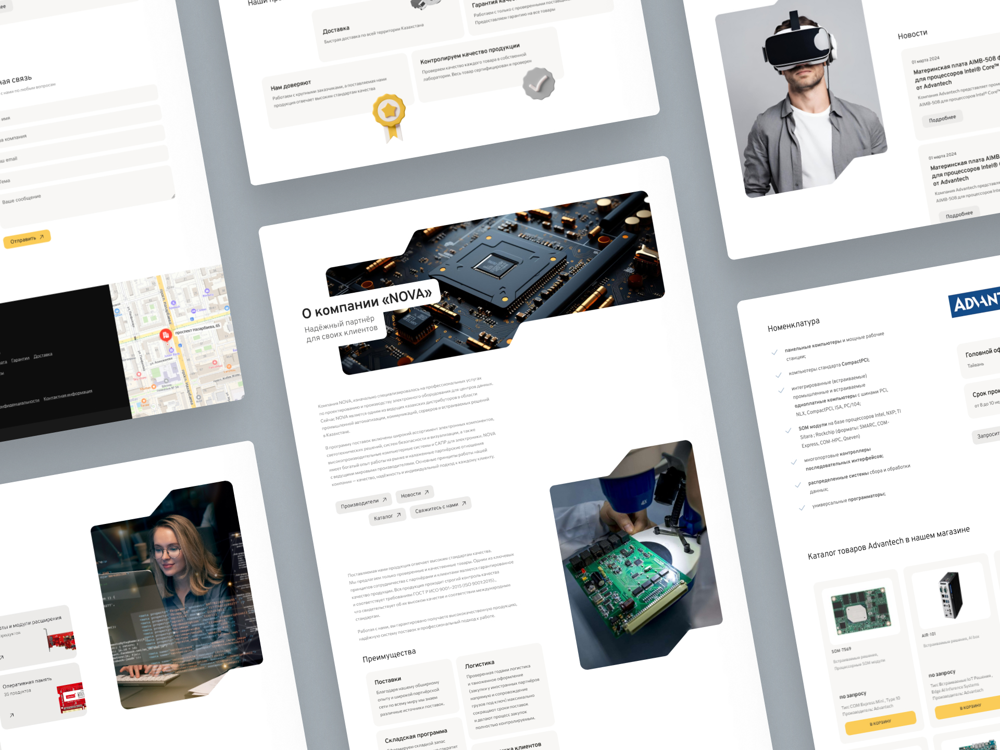
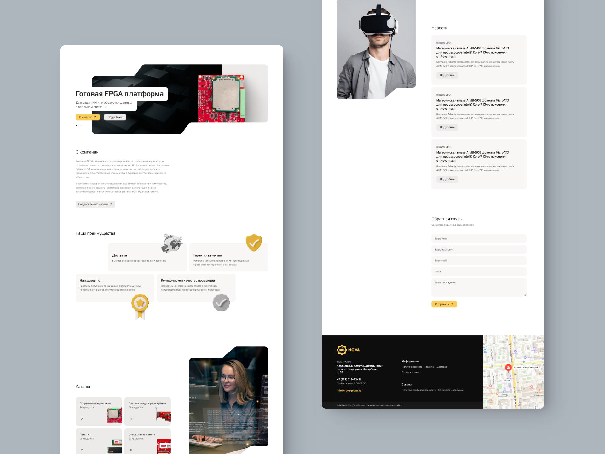
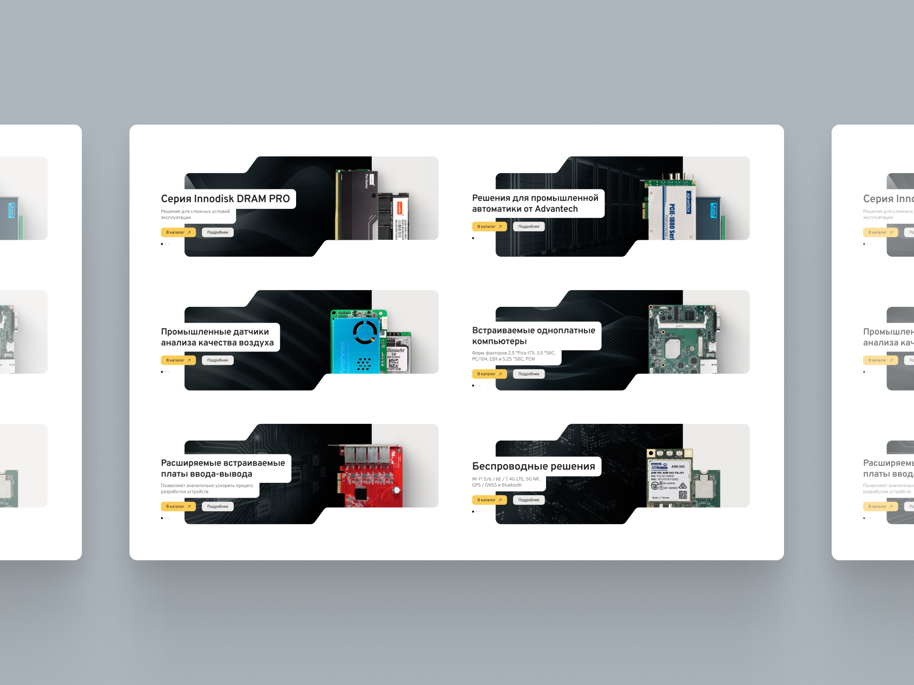
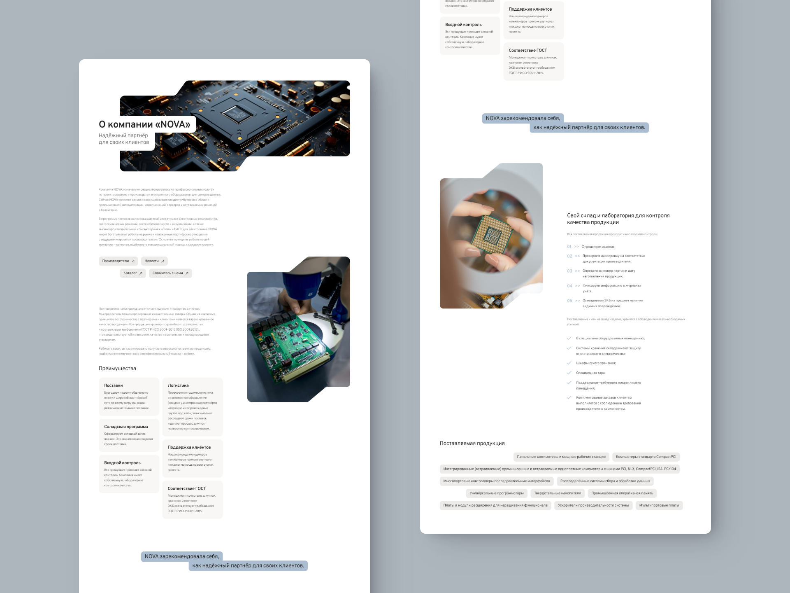
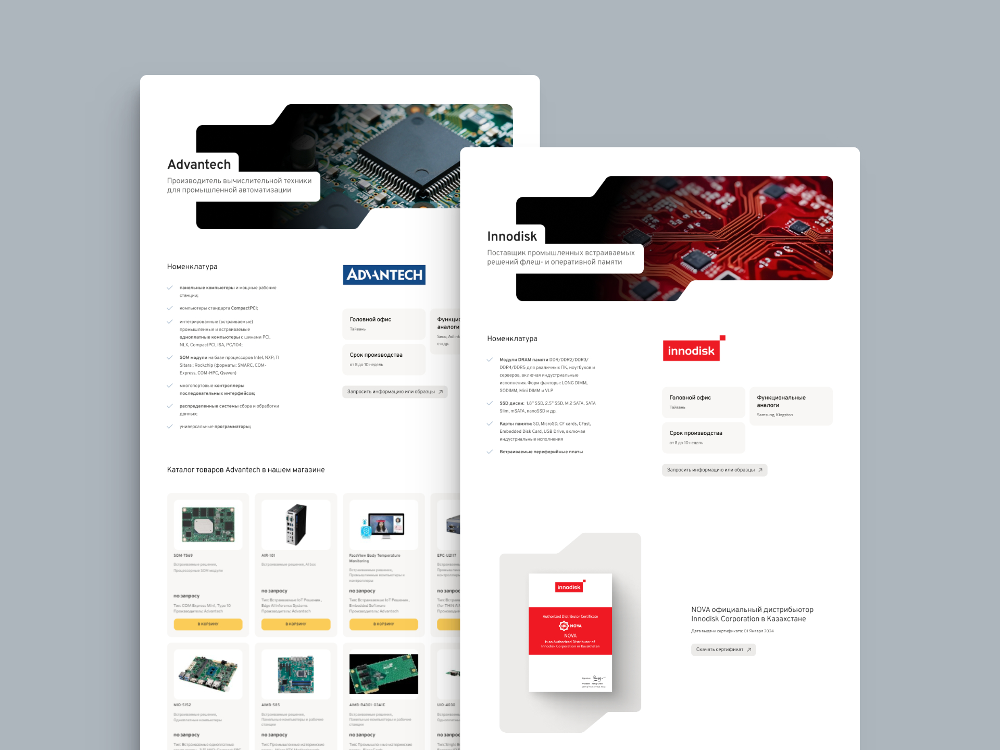

## Задача

Создать общий стиль сайта, а затем воплотить его на существующей сборке WordPress + Woocommerce, используя Elementor. В результате, получить готовый сайт с измененным каталогом, карточками товаров и фильтром в кратчайшие сроки. 

По возможности, использовать корпоративные цвета (золотой) и цвета производителей оборудования (красный и синий), чередование светлых и темных блоков, фоновые изображения с параллаксом (parallax).

Необходимо представить фотографии товаров в слайдере на главной странице. В качестве товаров, в основном, выступают различные платы, состоящие из красного и зеленого цветов.

## Решение

Учитывая тематику самого сайта (интернет-магазин по продаже промышленного компьютерного оборудования) и его целевую аудиторию, было принято решение создать сайт со светлой темой. Чередование светлых и темных блоков удалось достичь с помощью использования темных или нейтрально серых изображений и баннеров на сайте с технологичными, футуристическими формами: скошенными углами и краями.

В качестве акцентного цвета решено было оставить желто-золотой, поскольку он перекликается с логотипом и другим сайтом компании, что в свою очередь увеличивает узнаваемость бренда. В дополнение к нему были использованы различные оттенки серого -- как вспомогательные цвета.

Для того, чтобы решить проблему со слайдером на главной странице, во-первых, пришлось тщательно отобрать изображения товаров, в частности, по их ракурсу. Во-вторых, пришлось добавить тень к изображениям товаров, чтобы лучше объединить их с фоновыми изображениями.

