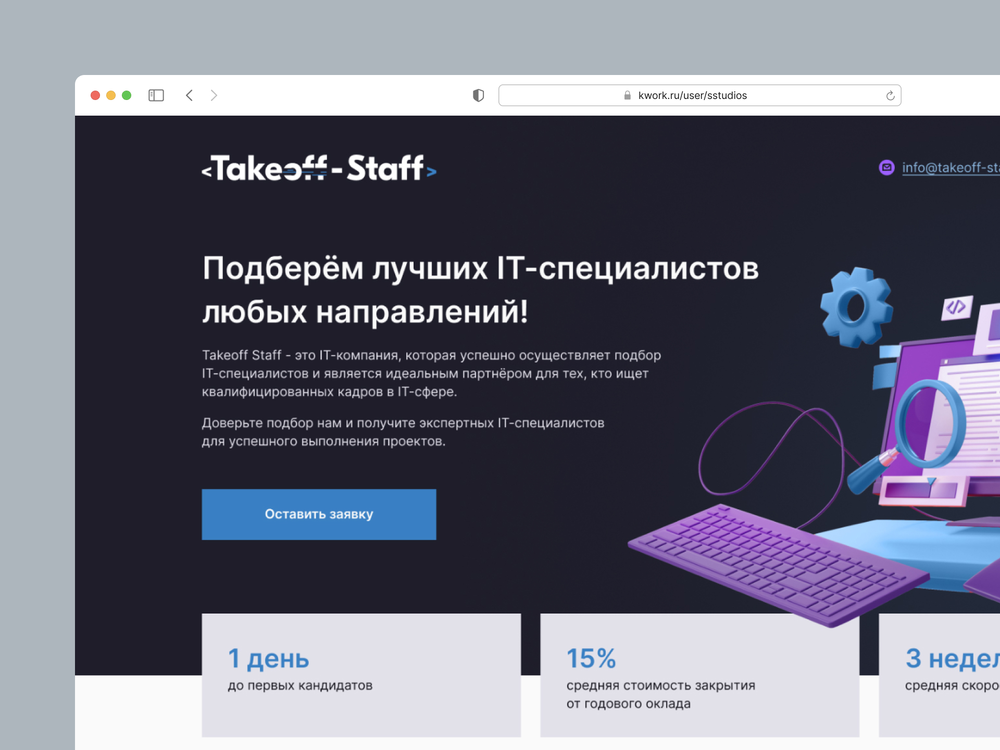
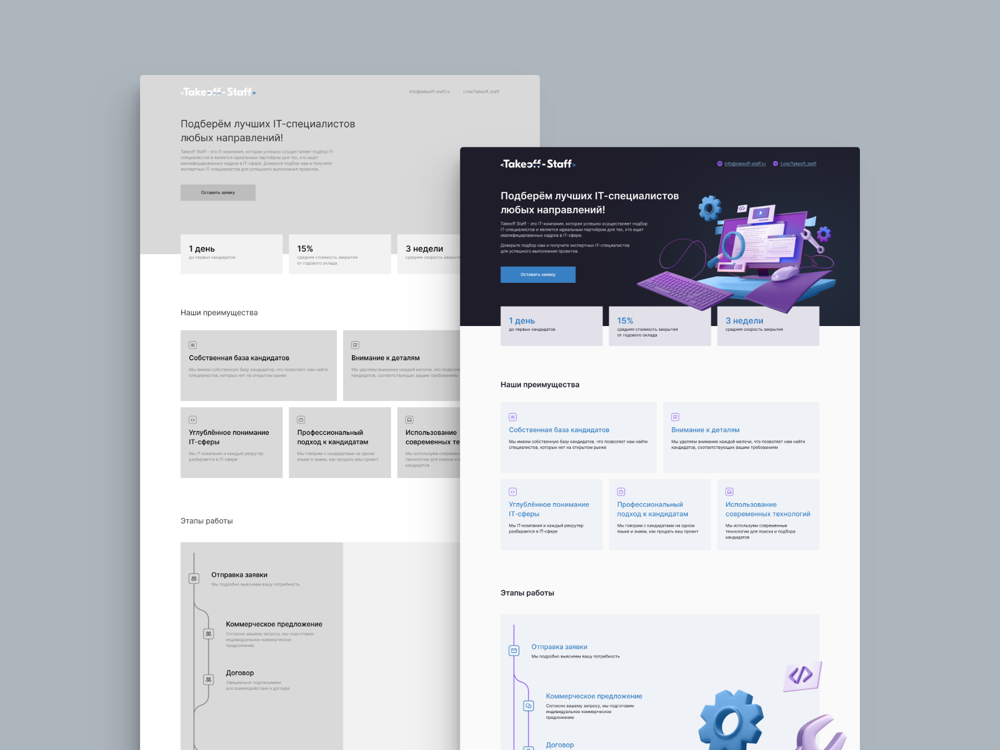
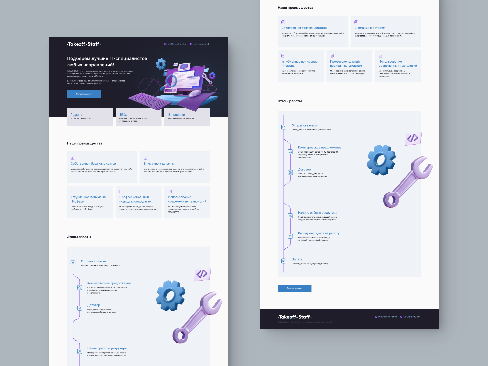

## Задача

Создать дизайн страницы по готовому прототипу. Получить окончательный результат в виде pdf-файла с интерактивными кнопками и ссылками.

Показать, что кнопки и ссылки в файле кликабельны. Предоставить возможность заказчику изменять ссылки в дизайне самостоятельно.

## Решение

1-й вступительный блок (hero) и блок с фактами были объединены, чтобы страница выглядела более наполненной, а преимущества работы дополнительно раскрывали сущность деятельности компании. Блок с этапами проекта, согласно тематике сайта, был оформлен на основе принципа работы Git.

Для изменения ссылок в макете, была предоставлен файл в Figma, вместе с соответствующей инструкцией по редактированию.