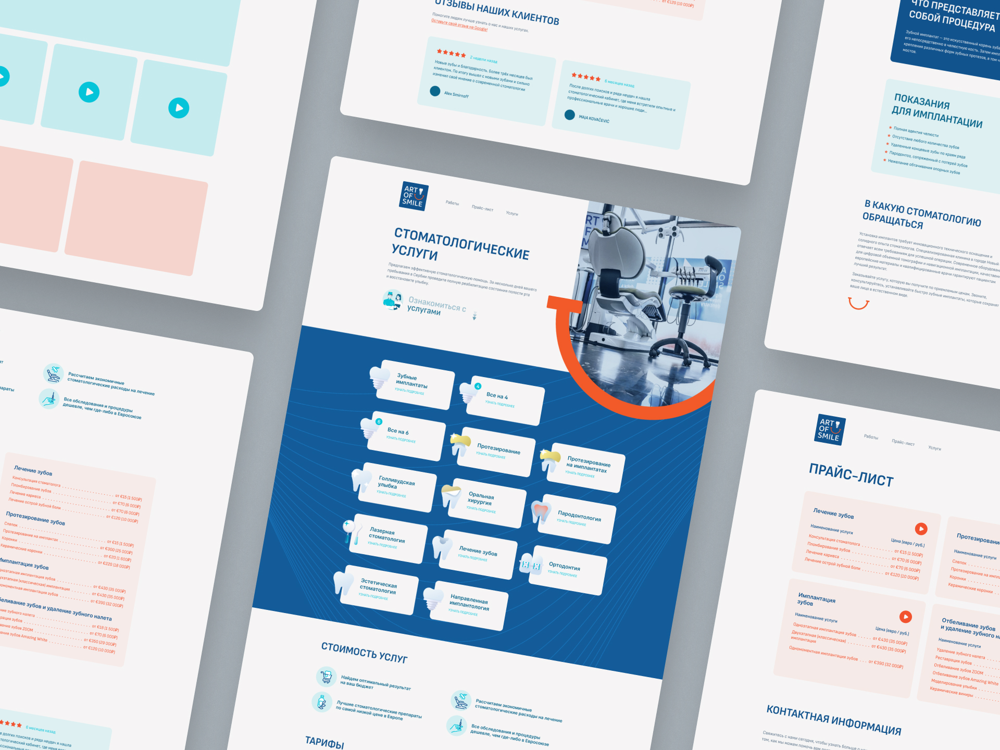
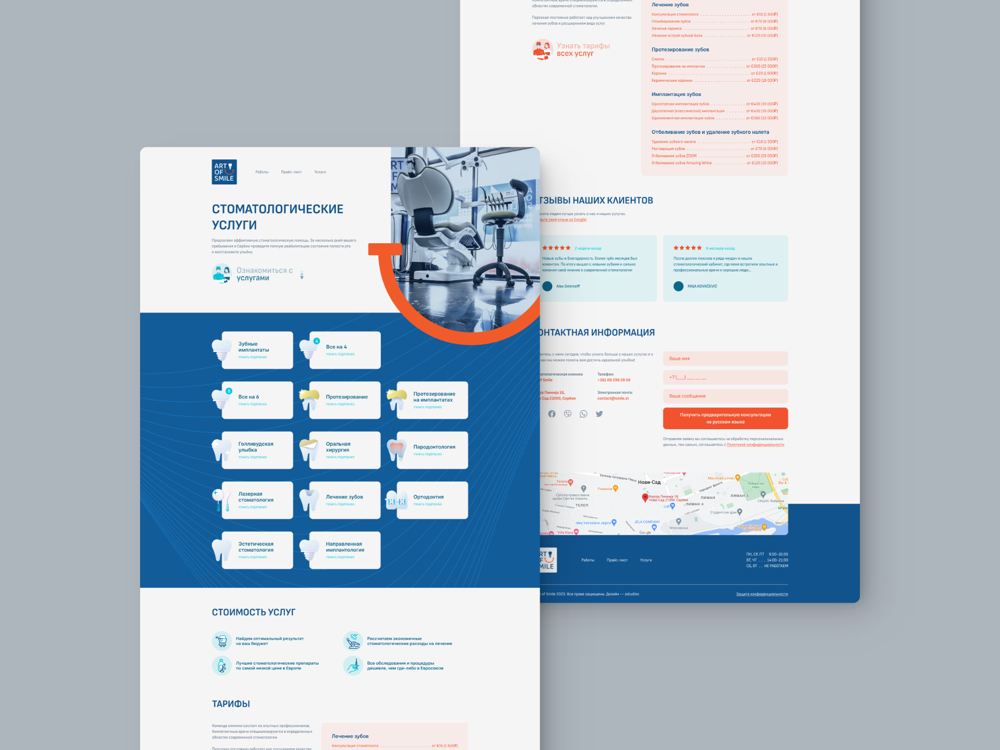
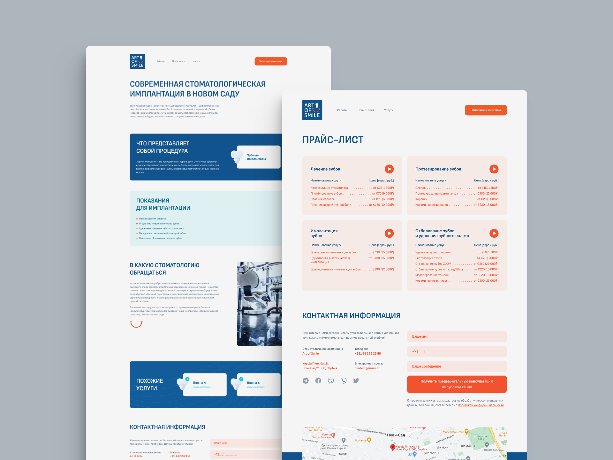

## Задача

Сделать современный дизайн для сайта стоматологической клиники. Проработать шрифты, стиль заголовков. Подобрать цвета сайта согласно фирменному логотипу. Интегрировать в дизайн фотографии клиники.

## Решение

Чтобы придать свежести и современности дизайну, было решено сделать фотографию во вступительном блоке сайта (hero) за гранью общей сетки блоков всего остального сайта, придать ей уникальную форму и объединить ее с "улыбкой" из фирменного логотипа.

Ярко оранжевая "улыбка" с логотипа не только хорошо обрамляет фото во вступительном блоке, но и является своеобразным мостом к следующему блоку с перечнем всех услуг.

Интересная структура карточек с иконками категориями услуг стоматологии так же, как и "улыбка" с логотипа, придает узнаваемости бренду.

