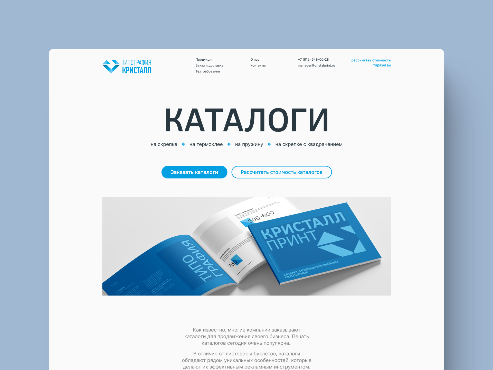
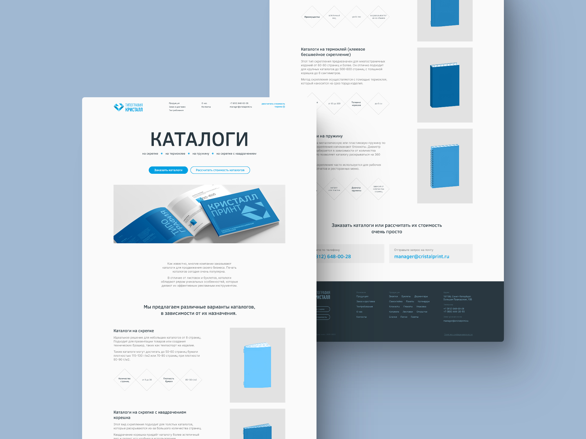
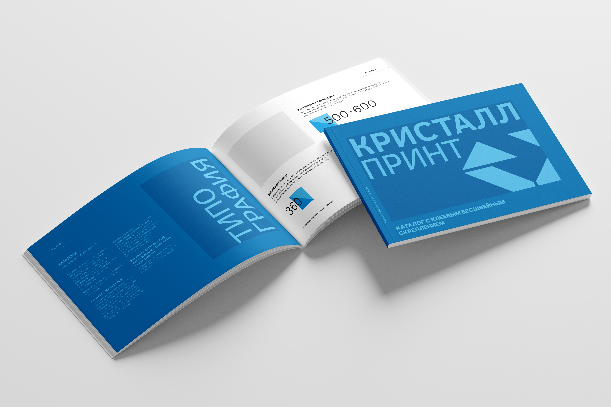

## Задача

Обновить устаревший визуальный дизайн сайта, сохранив при этом всё текстовое содержание. Необходимо изменить только внешний вид страниц. На сайте всего 15 таких страниц, поэтому дизайн должен быть гибким для адаптации под различные товары.

## Решение

Решено создать современный и чистый дизайн с минимальным количеством цветов и прочих отвлекающих внимание от контента элементов.

Заголовки оформлены шрифтом, схожим с логотипом, а текст — легко читаемым. Графические элементы тщательно проработаны, текст обновлён и украшен кристальными мотивами.

На странице использованы различные оттенки синего и мелкая графика в виде гранённого кристалла для согласованности с брендом.

## Дисклеймер

- Мокап каталога взят с сайта: [Mockup Nest](https://mockupnest.com/)
- Иллюстрации различных методов скрепления каталогов взяты с сайта: [Yellow Dog Denver](https://yellowdogdenver.com/small-format/booklet-catalog-printing-design/)

